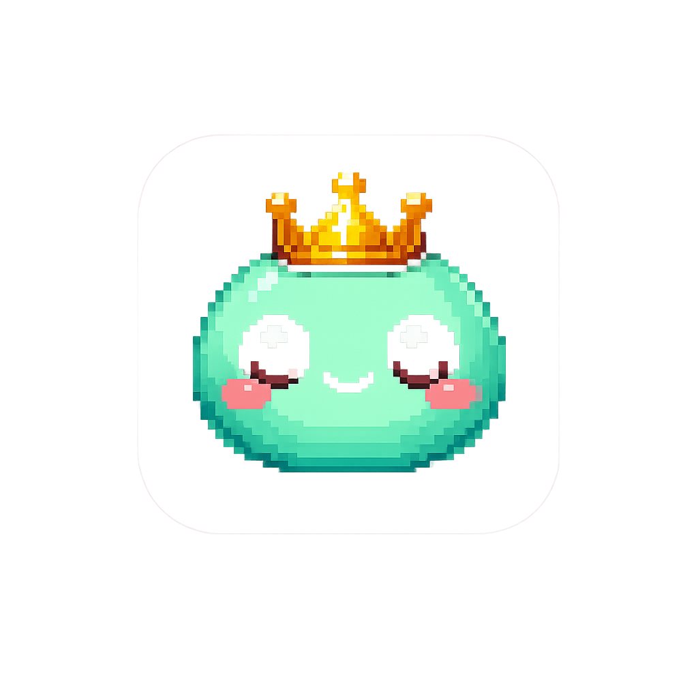

# Tamagotchi Desktop Pet

A classic Tamagotchi-style virtual pet game built with Electron. Raise your own pixel-art pet, manage its needs, watch it evolve through life stages, and discover its unique personality.



## Features

- **5 Life Stages**: Egg → Baby → Child → Teen → Adult
- **4 Core Stats**: Hunger, Happiness, Energy, Hygiene
- **6 Personalities**: Quirky, Cute, Funny, Absurd, Unhinged, or Sardonic — each with 65 unique quotes
- **Quote Bubbles**: Your pet talks to you with personality-themed speech bubbles
- **Day/Night Cycle**: Background changes with your system time
- **Random Events**: Poop appears, sickness from low hygiene
- **Auto-Save**: Game saves every 30 seconds and on quit
- **Evolution Quality**: Excellent care = gold variant (crown), neglect = poor variant (brown)

## Quick Start

### Development

```bash
npm install
npm start
```

### Build for Distribution

Build for your current platform:

```bash
npm run build
```

Or target a specific platform:

```bash
npm run build:win      # Windows installer (.exe)
npm run build:mac      # macOS disk image (.dmg)
npm run build:linux    # Linux AppImage
```

Output goes to the `dist/` folder.

## Project Structure

```
tamagotchi-desktop/
├── main.js               # Electron main process
├── preload.js            # Secure IPC bridge
├── package.json          # App manifest + build config
├── assets/
│   ├── icon.png          # App icon (Linux)
│   └── icon.ico          # App icon (Windows)
│   └── icon.icns         # App icon (macOS — generate with iconutil)
├── renderer/
│   ├── index.html        # Game UI
│   ├── styles.css        # Retro pixel-art theme
│   ├── pet.js            # Pet state, evolution, personalities
│   ├── animator.js       # Canvas rendering, particles
│   ├── ui.js             # DOM controls, quote bubbles
│   ├── game.js           # Game loop, save/load
│   ├── quotes.js         # 390 personality-themed quotes
│   └── data/
│       ├── pet-sprites/  # Pet stage sprites
│       ├── icons/        # Action button icons
│       ├── sprites/      # In-game sprites (food, effects, poop)
│       └── bg.png        # Background image
└── test/
    ├── runner.js         # Minimal test runner
    ├── pet.test.js       # Unit tests for Pet class
    └── visual/           # Visual regression tests + baselines
```

## Gameplay

Your pet needs constant care. All 4 stats decay by **1 every second** while awake. Sleeping restores energy (+2/s) but other actions remain blocked.

- **Hunger** — Feed (+25) with the FEED button
- **Happiness** — Play (+20) or Pet (+5) to raise it
- **Energy** — Sleep to restore (+2/s); pet falls asleep automatically at <15
- **Hygiene** — Clean (+30) and clear poop to maintain

Health is the average of all 4 stats. When it reaches 0, your pet dies. Keep it alive and happy to see it evolve!

## Tech Stack

- **Electron** — Desktop app framework
- **HTML5 Canvas** — Pet rendering with pixel-perfect scaling
- **CSS3** — Retro LCD aesthetic with scanlines
- **Vanilla JS** — No bundlers, no frameworks

## License

MIT
